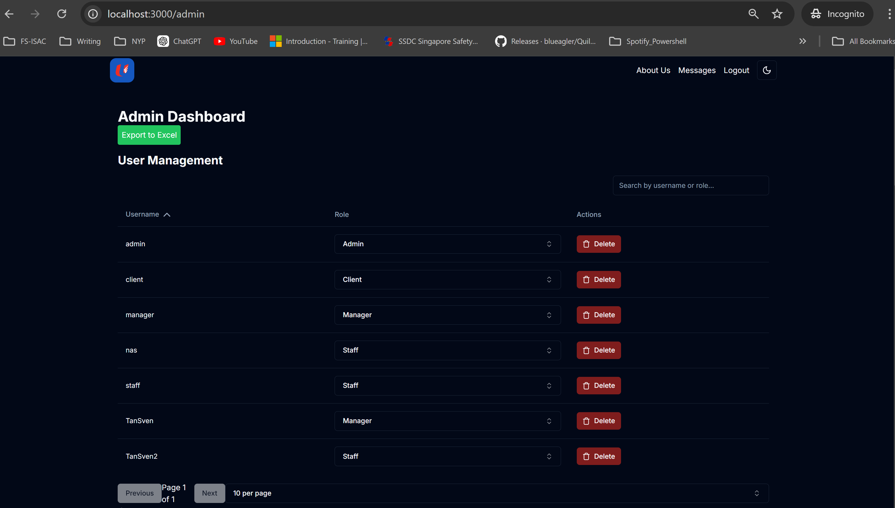
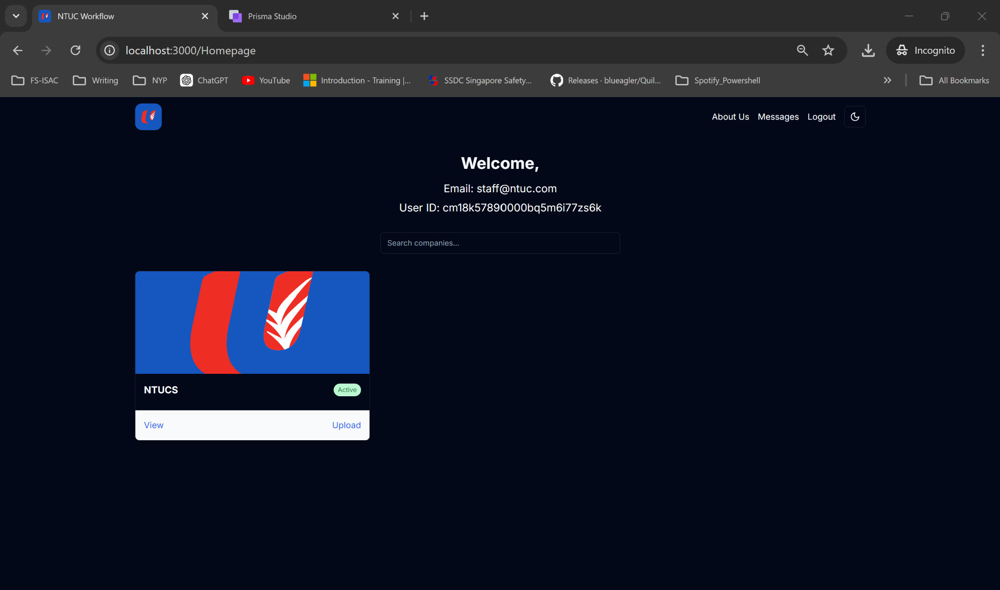

# Enhanced Food Label Compliance and Safety Monitoring System

## Overview

The **Enhanced Food Label Compliance and Safety Monitoring System** is a Next.js web application designed for NTUC FairPrice. It automates the scanning and verification of food labels to ensure compliance with Singapore regulations. By utilizing OCR and AI, it enhances label verification efficiency and accuracy. The system includes role-based access control, real-time notifications, and integrates with OpenAI and Nodemailer for advanced functionality.

## Features

- **Automated Label Scanning**
  - Extracts text from product labels using OCR technology to streamline the verification process.

- **Compliance Checking**
  - Assesses Halal and Healthy statuses with advanced Machine Learning models to ensure regulatory adherence.

- **User Authentication**
  - Secure login system utilizing JWT-based authentication and OTP verification for enhanced security.

- **Role-Based Access Control**
  - Different functionalities and permissions for Admins, Managers, and Staff to maintain organized workflows.

- **Company Management**
  - Create, update, archive/unarchive companies.
  - Assign staff and managers to specific companies.
  - View detailed information and associated images for each company.

- **Image Management**
  - Upload, view, and manage food label images efficiently.
  - Extract and analyze text from images using OCR (Tesseract.js).
  - Utilize AI (OpenAI's GPT-4) to analyze food safety and compliance.
  - Approve or reject images based on AI-driven compliance results.

- **Notifications**
  - Receive real-time alerts for role changes, company assignments, and image approvals/rejections to stay updated on important actions.

- **Search Functionality**
  - Easily search and filter companies and users to quickly find relevant information.

- **Data Export**
  - Export user, company, and image data to Excel files for reporting and analysis purposes.

- **Responsive UI**
  - Intuitive and user-friendly interface built with Tailwind CSS, ensuring accessibility across various devices.

## Technology Stack

- **Frontend**
    - [Next.js](https://nextjs.org/)
    - [React](https://reactjs.org/)
    - [Tailwind CSS](https://tailwindcss.com/)
    - [shadcn/ui](https://shadcn.com/)

- **Backend**
    - [Next.js API Routes](https://nextjs.org/docs/api-routes/introduction)
    - [Prisma ORM](https://www.prisma.io/)

- **Services**
    - [OpenAI](https://openai.com/) for AI-driven analysis
    - [Nodemailer](https://nodemailer.com/about/) for email services

- **Others**
    - [Tesseract.js](https://github.com/naptha/tesseract.js) for OCR
    - [Sonner](https://github.com/emilkowalski/sonner) for toast notifications
    - [Lucide React](https://lucide.dev/docs/lucide-react) for icons


## Getting Started

### Prerequisites

Before you begin, ensure you have the following installed on your system:

- **[Node.js](https://nodejs.org/)** (v18.x or later)
- **[Next.js](https://nextjs.org/)**
- **[pnpm](https://pnpm.io/)** (v7.x or later)
- **[Visual Studio Code](https://code.visualstudio.com/)** or any preferred code editor

### Installation

1. **Clone the Repository**
    - `
    git clone https://github.com/iamsven2005/FYP.git
    `

2. **Install Dependencies**
    - `
    pnpm install
    `

3. **Configure Environment Variables**

    - Rename `.env.example` to `.env` and fill in the required values.
    - Ensure all necessary environment variables are set, including:
        ```        
        - DATABASE_URL: Prisma database connection string.
        - JWT_SECRET: Secret key for JWT signing.
        - OPENAI_API_KEY: API key for OpenAI services.
        - EMAIL_SERVER_HOST, EMAIL_SERVER_PORT, EMAIL_SERVER_USER, EMAIL_SERVER_PASSWORD: Credentials for Nodemailer.
        - EMAIL_FROM: The sender email address for outgoing emails.
        ```

4. **Run Database Migrations and Seed Data**
    - `pnpm gen`: Generates the Prisma client.
    - `pnpm push`: Applies database migrations.
    - `pnpm seed`: Seeds the database with initial data.
        - Bypassed OTP Accounts for each role:
            ```
            - Admin: admin@ntuc.com, admin123
            - Manager: manager@ntuc.com, manager123
            - Staff: staff@ntuc.com, staff123
            ```

5. **Start Prisma Studio**

    Access Prisma Studio for database management and inspection.
    
    - `pnpm stu`

    Open http://localhost:5555 in your browser to access Prisma Studio.

    


6. **Start the Development Server**
    
    - `pnpm dev`
    
    This will start the Next.js development server on http://localhost:3000.

7. **Access the Application**

    Open http://localhost:3000 in your browser to use the application.

    


## Usage

### Authentication

 - Register a new user (default role staff) via the /api/register endpoint.
 - Login using the /api/login endpoint.
 - Reset Password through the /api/forgot-password and /api/reset-password endpoints.
   - Users who login and wants to reset password, will receive an OTP via email for enhanced security.


## User Roles and Usage

The system supports three main user roles: Admin, Manager, and Staff. Each role has specific functionalities tailored to their responsibilities.

### Admin

## Responsibilities:
 - **User Management:** Create, update, and delete user accounts (Admins, Managers, Staff).


 - **Company Management:** Create, edit, archive, and manage companies along with their assigned staff and managers.


 - **Product Information:** Able to view and search for food items or ingredients.


 - **System Oversight:** Configure system settings and manage compliance workflows.

 - **Generate Excel Report:** Admins have the ability to export user, company, and image data into an Excel report for tracking and analysis.

## Key Features:
 - **User Management Interface:**
    - Admins can view all registered users, assign or modify their roles (Admin, Manager, Staff, and Client), and delete users as necessary.
    - User roles can be reassigned from the admin dashboard.
    - Deleting a user prompts a confirmation message to avoid accidental removal.
    

    ``` bash
    // Example: Assigning a role to a user
    const handleRoleChange = (userId: string, newRole: string) => {
      setSelectedRoles((prevRoles) => ({ ...prevRoles, [userId]: newRole }));
      assignRole(userId, newRole);
    };
      ```
 - **Company Management Interface:**
   - Admins can create new companies by inputting the company name, uploading an image, and assigning staff and managers to that company.
   - Existing companies can be edited, archived, or unarchived through the dashboard.
   - Admins can view detailed company information including staff and managers assigned.
    ``` bash
    // Example: Toggling company archive status
    const toggleArchiveCompany = async (companyId: string, archived: boolean) => {
        // Update company archive status
    };
    ```

  - **Data Export (Generate Excel Report):**
    - Admins can generate a report in Excel format for tracking all users, companies, and food images in the system. This report contains detailed records of users, their roles, companies, and images that have been processed.

#### Example: Generating Excel Report

Admins can export data using the **Export to Excel** button available on the dashboard. This function will create a workbook with three sheets `Users`, `Companies`, and `Images` which can then be downloaded as an Excel file.

```bash
// Function to export data to Excel
const exportToExcel = () => {
  // Prepare data for each section
  const usersData = AUsers.map(user => ({
    id: user.id,
    name: user.username,
    role: user.role,
    email: user.email,
  }));

  const companyData = clist.map(data => ({
    id: data.id,
    name: data.name,
    staff: data.staff,
    manager: data.manager,
    archived: data.archived,
    create: data.createdAt,
  }));

  const imagesData = images.map(image => ({
    id: image.id,
    name: image.name,
    companyId: image.companyId,
    status: image.status,
    halal: image.halal ? "Yes" : "No",
    healthy: image.healthy ? "Yes" : "No",
    ai: image.AI,
    retrived: image.retrived,
  }));

  // Create a new workbook
  const wb = XLSX.utils.book_new();

  // Add each section as a sheet
  XLSX.utils.book_append_sheet(wb, XLSX.utils.json_to_sheet(usersData), "Users");
  XLSX.utils.book_append_sheet(wb, XLSX.utils.json_to_sheet(companyData), "Companies");
  XLSX.utils.book_append_sheet(wb, XLSX.utils.json_to_sheet(imagesData), "Images");

  // Export the workbook as an Excel file
  XLSX.writeFile(wb, "data_export.xlsx");
};
```


## Usage:

 1. **Accessing Admin Dashboard:**
    - Log in using your admin credentials.
    - Navigate to the Admin Dashboard to manage users and companies.

 2. **Managing Users:**
    - Use the User Management section to add or remove users.
    - Assign appropriate roles to ensure users have the necessary permissions.

 3. **Managing Companies:**
    - Create new companies or edit existing ones through the Company Management section.
    - Assign staff and managers to each company for oversight and workflow management.
 
 4. **Generating Reports:**
    - Admins can use the "Export to Excel" button to download detailed reports containing data on users, companies, and uploaded images for compliance tracking and analysis.
 
### Manager

#### Responsibilities:
- **Compliance Oversight:** Monitor compliance processes and ensure adherence to regulations.
- **Review and Approval:** Once staff post-process a food item, it will then be available for the manager to review. The manager can review the extracted information, including ingredients and food advisories, and decide whether to approve or reject the item.
- **Status Update:** After the manager makes a decision, the status (Approved/Rejected) is reflected for both Admin and Staff.

#### Key Features:
- **Notification Management:**
  - Receive alerts about new uploads and compliance issues.
  - Address and resolve compliance-related notifications.

#### Usage:

1. **Accessing Manager Dashboard:**
   - Log in using your manager credentials.
   - Navigate to the Manager Dashboard to oversee compliance activities.

2. **Reviewing and Approving/Rejecting Food Items:**
   - Review the uploaded food items and their associated information, including the list of ingredients.
   - Ingredients are color-coded:
     - **Green**: Approved ingredients, present in the approved ingredients list.
     - **Amber**: Not in the approved list, but generally considered safe.
     - **Red**: Not safe/illegal ingredients.
   - The manager can approve or reject the item based on the ingredient list and the AI-driven advisories.
   
3. **Reflecting Approval/Rejection:**
   - Once the manager approves or rejects an item, the status is updated, and both Admin and Staff can see the updated status for that food item.

**Example Manager View:**
The manager can see the list of companies they manage and view the details of each company, including the list of food items awaiting approval.


Upon selecting a food item for review, the manager sees a detailed breakdown of the extracted ingredients, their status, and the advisory generated by the AI analysis.


### Staff

## Responsibilities:
- **Label Management:** Upload product labels submitted by stakeholders.
- **Compliance Verification:** Conduct compliance checks using predefined checklists (ingredients.json).
- **Approval/Rejection:** Approve or reject ingredients based on compliance results.
- **Risk Advisory:** Provide guidance and risk assessments to stakeholders regarding compliance issues.

## Key Features:
- **Image Upload and Management:**
    - Easily upload product label images for compliance verification.
    - View and manage uploaded images through the dashboard.

    ```bash
    // Example: Handling image upload
    const handleImageChange = (e: React.ChangeEvent<HTMLInputElement>) => {
      const file = e.target.files?.[0];
      if (file) {
        const reader = new FileReader();
        reader.onloadend = () => {
          setCompanyImgUrl(reader.result as string);
        };
        reader.readAsDataURL(file);
      }
    };
    ```

- **Compliance Checks:**
  - Use integrated OCR and Machine Learning tools, such as OpenAI API, to verify label information.
  - Approve or reject ingredients as per compliance guidelines.

- **Workflow Management:**
  - Route approval or rejection tasks to appropriate parties. (Manager and Admin).
  - Track the status of compliance tasks through the dashboard. (Await for approval from manager).

## Usage:

1. **Accessing Staff Dashboard:**
   - Log in using your staff credentials.
   - Navigate to the Staff Dashboard to manage label uploads and compliance checks.



2. **Uploading Labels:**
   - Use the Image Management section to upload new product labels.
   - Ensure all necessary fields, such as the item name and the image, are filled out before submission.


3. **Conducting Compliance Checks:**
   - Review the extracted text and compliance results for each uploaded label.
   - Approve or reject ingredients based on the compliance analysis.


### License

This project is licensed under the MIT License.